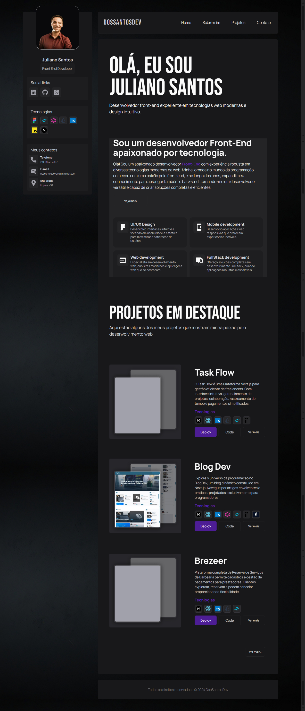
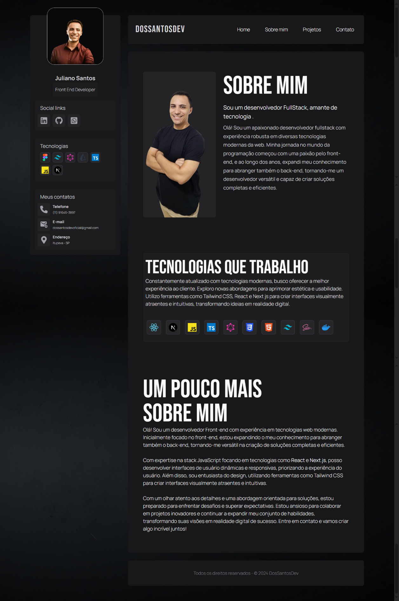
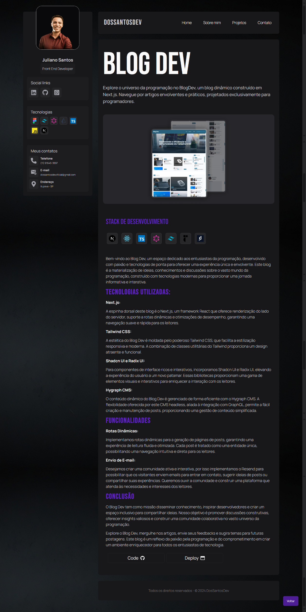
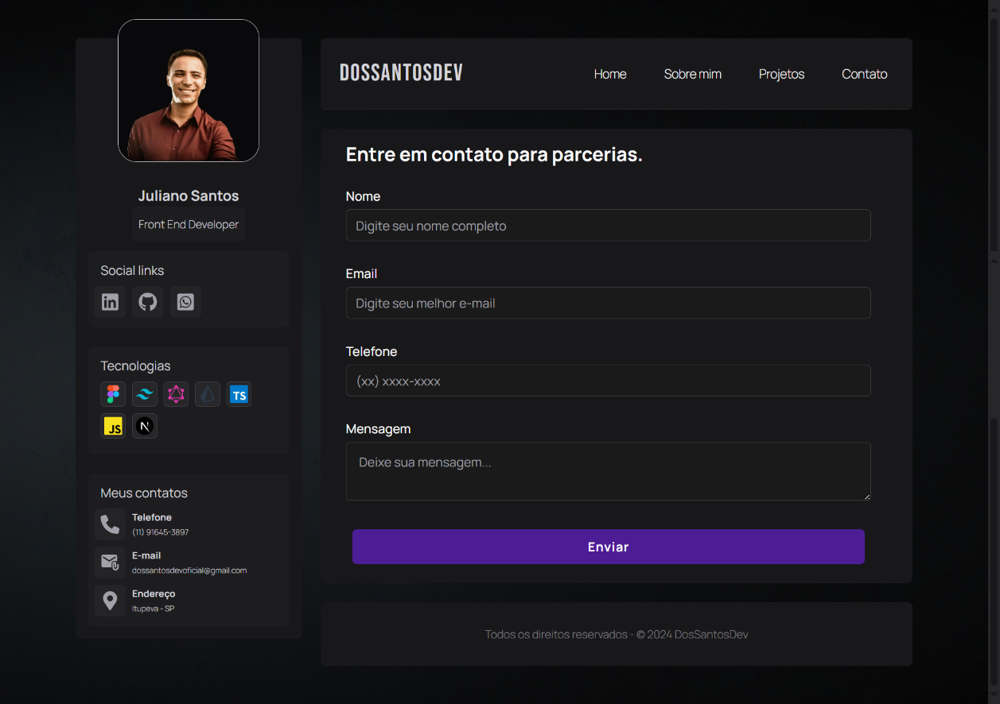

# Meu Portfólio de Desenvolvedor

Bem-vindo ao repositório do meu portfólio de desenvolvedor! Este projeto foi criado para mostrar minhas habilidades em desenvolvimento Full-Stack, com ênfase em tecnologias como React e Next.js, e exibir alguns dos meus melhores projetos.

## 📜 Sobre o Projeto

Este portfólio é um site que reúne informações sobre mim, minhas habilidades técnicas, projetos desenvolvidos, e formas de contato. Ele foi projetado para ser uma vitrine interativa, onde posso compartilhar meu progresso, novas conquistas e colaborações.

## 🛠️ Tecnologias e Ferramentas

Este projeto foi desenvolvido com as seguintes tecnologias e ferramentas:

- **Next.js**: Estrutura de React para renderização do lado do servidor e criação de sites dinâmicos.
- **React**: Biblioteca JavaScript para construção de interfaces de usuário.
- **Tailwind CSS**: Framework de CSS utilitário para um design responsivo e moderno.
- **Zod**: Validação de formulários.
- **Hygraph**: CMS para gestão de conteúdo.
- **Vercel**: Plataforma de deploy para aplicações front-end.

## 🚀 Recursos

- **Responsividade**: O design do portfólio se adapta a diversos dispositivos, proporcionando uma boa experiência em smartphones, tablets e desktops.
- **Componentização**: Cada seção do site é modularizada em componentes React reutilizáveis.

- **Contato por e-mail**: Uilizamos a plataforma resend para receber e-mails de contato.

## 📸 Pré-visualização

### Página Inicial

### Página Sobre mim

### Página detalhes de um projeto

### Página contato

